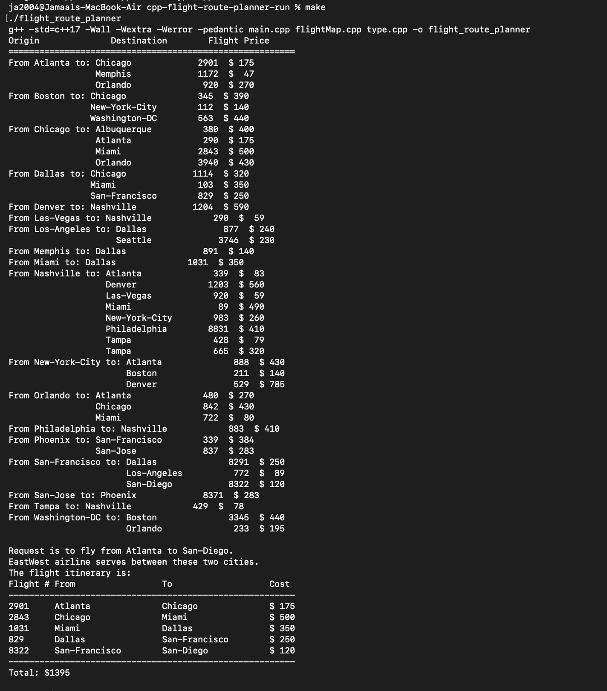

# C++ Flight Route Planner

A graph-based flight itinerary planner written in C++. The program loads cities and directed flights from data files, builds an adjacency-list representation of the airline network, and processes route requests using iterative depth-first search.

This is a portfolio version of my CSCI 3110 Algorithms and Data Structures course project. I cleaned and reorganized the source for GitHub while preserving the original graph structure, stack-based route search, input data, and itinerary behavior.

## Why This Project Matters

This project demonstrates core computer science concepts that are different from my Python networking and GUI projects:

- Graph representation with adjacency lists
- Iterative depth-first search using an STL `stack`
- Visited-node tracking and backtracking
- Path reconstruction between an origin and destination
- C++ classes, structs, operator overloading, vectors, lists, and file I/O
- Parsing structured flight and route-request data

## Features

- Loads a list of supported cities from a data file
- Builds a directed flight graph from flight number, origin, destination, and price records
- Stores outgoing flights in sorted adjacency lists
- Displays the complete flight network
- Checks whether both requested cities are served
- Searches for a valid route without recursion
- Reconstructs and prints the selected itinerary
- Calculates the total ticket cost for the generated route
- Reports requests for which no route exists

## Route Search

The route search uses iterative depth-first search rather than Dijkstra's algorithm.

The origin city is pushed onto a stack and marked as visited. The program repeatedly chooses the first unvisited adjacent city from the current city's sorted flight list. If a city has no remaining unvisited neighbors, the search backtracks by popping the stack. Parent-flight information is stored so the final itinerary can be reconstructed after the destination is found.

Because this project searches for a valid route rather than the mathematically cheapest route, the displayed itinerary is determined by graph traversal order.

## Project Structure

```text
cpp-flight-route-planner/
├── main.cpp
├── flightMap.cpp
├── flightMap.h
├── type.cpp
├── type.h
├── Makefile
└── data/
    ├── cities.dat
    ├── flights.dat
    └── requests.dat
```

## Build and Run

Using Make:

```bash
make
./flight_route_planner
```

Or run both steps with:

```bash
make run
```

To compile manually:

```bash
g++ -std=c++17 -Wall -Wextra -Werror -pedantic main.cpp flightMap.cpp type.cpp -o flight_route_planner
./flight_route_planner
```

The program uses the files in the `data/` directory by default. You can also provide three file paths manually:

```bash
./flight_route_planner cities.dat flights.dat requests.dat
```

## Demo

The terminal output below shows the project compiling successfully with `make`, loading the flight network, and generating a complete itinerary from Atlanta to San Diego.



## Example Itinerary

A request from Atlanta to San Diego produces:

```text
Request is to fly from Atlanta to San-Diego.
EastWest airline serves between these two cities.
The flight itinerary is:
Flight # From                 To                   Cost
--------------------------------------------------------
2901     Atlanta              Chicago              $ 175
2843     Chicago              Miami                $ 500
1031     Miami                Dallas               $ 350
829      Dallas               San-Francisco        $ 250
8322     San-Francisco        San-Diego            $ 120
--------------------------------------------------------
Total: $1395
```

## Data Model

Each flight is represented by a `flightRec` containing the origin city, flight number, destination city, and ticket price.

`FlightMapClass` stores the airline network as:

```cpp
std::vector<std::list<flightRec>> map;
```

Each vector position corresponds to one city, while its linked list contains the outgoing flights from that city.

## What I Learned

This project strengthened my understanding of how graph algorithms translate into working software. It required coordinating vectors, linked lists, a stack, visited-state tracking, path reconstruction, and structured file input in one program.

## Author

**Jamaal Abdi**

Computer Science student focused on backend development, data structures, algorithms, and systems programming.
